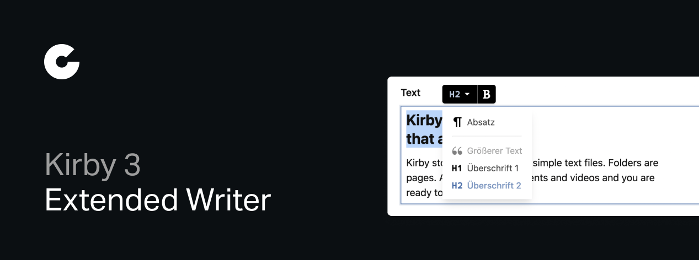

# Extended Writer

Extended Writer supercharges Kirby's built-in Writer field and block with useful marks, nodes and features you wish were built-in.

## Features

- New marks:
  - **Highlight**: Highlight text using the html `<mark>` tag
- New nodes:
  - **Larger Paragraph**: A larger paragraph, e.g. for short introduction or highlighted passages. (`<div class="-larger-paragraph">`)
- Enable & disable heading levels of the heading node with `h1`/`h2`/`h3`/`h4`/`h5`/`h6`
- Node property support for the List field, to disable the default bullet list or ordered list nodes
- Styling customizations via props (e.g. text-align)

## Requirements

- `Kirby` >= 3.6.0
- `php` >= 7.4 / 8.0

## Installation

### Download

Download and copy this repository to `/site/plugins/kirby-extended-writer`.

### Git Submodule

```
git submodule add https://github.com/coralic/kirby-extended-writer.git site/plugins/kirby-extended-writer
```

### Composer

```
composer require coralic/kirby-extended-writer
```

## Usage

This plugin adds the mark `highlight` and the nodes `largerParagraph`, `h1`, `h2`, `h3`, `h4`, `h5` and `h6`.
You can activate them in the writer field like this:

```yaml
text:
  label: Text
  type: writer
  marks:
    - bold
    - italic
    - link
    - email
    - highlight
  nodes:
    - h1
    - h2
    - h3
    - largerParagraph
    - bulletList
    - orderedList
```

## Credits

- [Johann Schopplich](https://github.com/johannschopplich) for his [Custom Writer field marks boilerplate](https://github.com/johannschopplich/kirby-writer-marks) and the wonderful [kirbyup](https://github.com/johannschopplich/kirbyup) bundler
- [Roman Steiner](https://github.com/rasteiner) for his [Oh Hi Mark plugin](https://github.com/rasteiner/oh-hi-mark)

## License

[MIT License](./LICENSE) © 2021-2022 [Tobias Möritz](https://github.com/tobimori)
